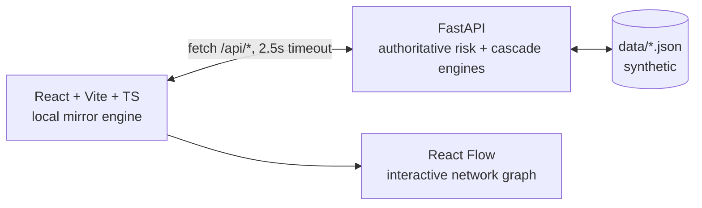

# MediCascade — Regional Medicine Shortage Cascade Intelligence

> **From one empty shelf to a regional shortage: what happens next?**

MediCascade is a hackathon demonstration prototype that shows how a small disruption
(e.g. *Supplier Alpha delayed by 7 days*) can propagate through a regional healthcare
supply network — and lets decision-makers compare possible interventions **before acting**.

**Workflow: DETECT → MAP → SIMULATE → INTERVENE.** Humans remain in control throughout.

---

## 1. Problem

Medicine shortages can begin locally — for example, through a delayed supplier,
depleted inventory buffer, or replenishment disruption — and create pressure across
interconnected facilities.

Conventional inventory dashboards primarily show current stock and shortage status.
MediCascade focuses on the next question:

> **“How could this risk propagate through an interconnected regional network?”**

---

## 2. Solution

MediCascade maps the healthcare supply network, computes explainable facility risk from
stock coverage, replenishment gap, supplier dependency, and network exposure, then
simulates disruption cascades on an interactive graph.

Decision-makers can also compare intervention scenarios such as redistribution or
alternative sourcing and inspect the resulting trade-offs before acting.

---

## 3. Core Innovation

### **Regional Shortage Cascade Intelligence**

MediCascade is not positioned as generic shortage prediction.

Its core differentiator is the combination of:

* **Deterministic, explainable facility-risk analysis**
* **NetworkX-based supply-network propagation**
* **Regional cascade exposure measurement**
* **Critical-node and network-resilience analysis**
* **What-if disruption simulation**
* **Surplus-opportunity detection**
* **Intervention trade-off analysis**

The system can show that helping one facility may consume another facility's
inventory buffer — making the consequence of an intervention visible rather than
hiding it behind a single “recommended action.”

---

## 4. Architecture



### Hybrid Reliability

The frontend first attempts to use the FastAPI backend.

If the backend is unavailable, it falls back to an embedded deterministic mirror
(`localEngine.ts`) containing the same core formulas and demo data.

The interface displays an `API` / `LOCAL` status badge so the execution mode remains
visible.

**Result:** the core demonstration can continue even if the backend becomes
unavailable during a presentation.

---

## 5. Data

All project data is **synthetic demonstration data**.

It includes:

* Facilities
* Medicines
* Suppliers
* Inventory
* Consumption
* Replenishment information
* Supply relationships
* Redistribution links
* Geographic coordinates

There is:

* No patient data
* No real hospital statistics
* No proprietary hospital inventory
* No clinical decision-making

Hero medicine:

**Amoxicillin 500mg**

---

## 6. Explainable Risk Engine

The core coverage and replenishment calculations use:

```text
coverage = stock / daily_consumption
gap      = ETA − coverage
```

The risk score combines four explainable components:

```text
Cover      ≤ 35
Gap        ≤ 30
Supplier   ≤ 30
Network    ≤ 13
```

The final score is clamped to `0–100`.

Risk states:

```text
0–30   → Stable
31–60  → Vulnerable
61–100 → High Risk
```

Every risk result contains its factor breakdown and a generated `Why?` explanation
based on the underlying values.

Selecting a facility exposes:

* Risk score
* Factor contributions
* Before → after changes
* Coverage
* Replenishment ETA
* Replenishment gap
* Supplier status
* Network resilience
* Safety-stock information
* Evidence table

The explanations are derived from computed values rather than generated as
unsupported AI claims.

---

## 6b. Cascade Exposure & Critical Nodes

### Cascade Exposure

Regional cascade exposure is calculated as:

```text
(high-risk facilities + 0.5 × vulnerable facilities)
----------------------------------------------------- × 100
                 total facilities
```

The dashboard displays:

**Before → After → Change in percentage points**

and labels the result as **Synthetic Simulation**.

### Critical Nodes

Critical-node analysis identifies suppliers with high downstream dependency and
limited alternatives.

In the current demonstration network:

* **Alpha:** 4 direct dependent facilities — Limited alternative supply
* **Beta:** 2 direct dependent facilities — Partial alternatives
* **Gamma:** 1 direct dependent facility — Partial alternatives

These values are derived from the configured synthetic sourcing network.

---

## 7. Cascade Simulation

The simulation accepts:

```text
POST /api/simulate
{
  supplier_id,
  delay_days,
  medicine_id,
  demand_change_pct
}
```

The engine:

1. Identifies downstream facilities using the supply-network graph.
2. Applies the simulated supplier disruption.
3. Adjusts affected replenishment timelines.
4. Recomputes facility risk.
5. Measures regional cascade exposure.
6. Identifies potential surplus facilities.
7. Generates a simulation timeline.
8. Produces explainable alerts.

The current demonstration scenario uses:

> **Supplier Alpha delayed by 7 days**

This changes Hospital A from:

```text
27 — Stable
```

to:

```text
65 — High Risk
```

while the disruption propagates to other connected facilities.

---

## 8. Intervention Analysis

MediCascade does not automatically execute procurement or redistribution.

Instead, it provides **simulated comparisons** that keep the human decision-maker
in control.

The current demonstration compares:

### No Action

Allow the simulated cascade to continue.

### Redistribute B → A

Simulate moving up to **1,500 units** from Hospital B to Hospital A.

Example simulated coverage:

```text
Hospital A: 8.0d → ~10.5d
Hospital B: 17.1d → ~15.0d
```

The system explicitly displays the cost of helping A:

> **Hospital B loses approximately 2.1 days of inventory buffer.**

### Alternative Supplier

Simulate switching Hospital A toward the alternative supplier **Beta**.

All intervention cards are labelled:

> **SIMULATED COMPARISON — HUMAN DECISION REQUIRED**

The system does not label an intervention as “optimal” or automatically select one.

---

## 9. Lightweight Trend Projection

The Shortages view includes a lightweight trend projection using the existing
consumption signal and user-controlled demand-change scenario.

It provides:

* Projected coverage
* Projected replenishment gap
* Trend-based risk timing

This is intentionally presented as a **trend estimate**, not as a trained forecasting
model.

Historical-data-backed forecasting is reserved for a future version where sufficient
historical operational data is available.

---

## 10. Technology Stack

### Frontend

* React 19
* Vite
* TypeScript
* Tailwind CSS v4
* React Flow
* Recharts
* Lucide

### Backend

* FastAPI
* Uvicorn
* Python
* Pandas
* NumPy
* NetworkX

### Data

* Structured synthetic JSON data
* Mirrored local demo dataset

No paid or external API dependency is required for the core demonstration.

---

## 11. Running Locally

### Terminal 1 — Backend

```bash
cd medicascade/backend
py -m pip install -r requirements.txt
py -m uvicorn app.main:app --port 8000
```

### Terminal 2 — Frontend

```bash
cd medicascade/frontend
npm install
npm run dev
```

Open:

```text
http://localhost:5173
```

The header displays:

```text
API
```

when the backend is available, or:

```text
LOCAL
```

when the frontend mirror is being used.

---

## 12. 60-Second Demonstration

### 1. Baseline

The Overview begins with:

* Regional exposure: **Low — 14.3%**
* Hospital A: Stable
* Hospital C: Vulnerable
* Hospital B: Surplus opportunity

### 2. Run Demo

Press:

> **▶ RUN DEMO**

The staged demonstration progresses through:

```text
Baseline
   ↓
Hospital A evidence
   ↓
Supplier Alpha +7d disruption
   ↓
Network propagation
   ↓
T+ timeline
   ↓
Regional exposure increase
   ↓
Hospital B surplus discovery
   ↓
Intervention comparison
```

### 3. Cascade

The network graph visually reveals the disruption from:

```text
Supplier → CDC → Hospital A → connected facilities
```

The timeline shows when simulated pressure and risk escalation appear.

### 4. Intervention Finale

The demonstration ends **frozen** on the:

> **SIMULATED TRADE-OFF**

view.

The judge can compare:

* No action
* B → A redistribution
* Alternative supplier

alongside risk, coverage, regional exposure, and inventory-buffer consequences.

There is **no automatic reset**.

Press **RESET** manually to replay the demonstration.

---

## 13. Limitations

MediCascade is a hackathon demonstration prototype.

Current limitations include:

* Synthetic data only
* Simplified replenishment and consumption assumptions
* Lightweight trend projection rather than trained historical forecasting
* No real procurement integration
* No real-time hospital inventory feeds
* No clinical decision-making
* No automatic procurement or redistribution
* No patient data processing
* No production-grade authentication or audit infrastructure

The system is intended for **decision-support demonstration**, not clinical use.

---

## 14. Roadmap

Future development could include:

* Historical-data-backed forecasting
* Multi-medicine cascade modeling
* Real-time shortage and supply feeds
* Geographic map integration
* SQLite/PostgreSQL persistence
* Authentication and role-based access
* Audit trails
* Production-grade disruption feeds
* Integration with institutional inventory systems
* Larger regional and national network models

---

## 15. Project Vision

A shortage should not become visible only when the shelf is empty.

MediCascade aims to make the **network effect visible earlier**:

```text
DETECT
   ↓
MAP
   ↓
SIMULATE
   ↓
INTERVENE
```

> **Don't wait for the empty shelf. See the cascade before it spreads.**

**MediCascade — Regional Medicine Shortage Cascade Intelligence**
