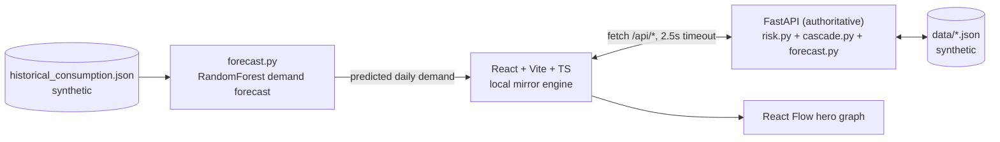

# MediCascade — Regional Medicine Shortage Cascade Intelligence

> **From one empty shelf to a regional shortage: what happens next?**

MediCascade is a hackathon demonstration prototype that shows how a small disruption
(e.g. *Supplier Alpha delayed by 7 days*) propagates through a regional healthcare
supply network — and lets decision-makers compare interventions **before** acting.

**Workflow: DETECT → MAP → SIMULATE → INTERVENE.** Humans remain in control throughout.

## 1. Problem

Medicine shortages rarely start region-wide. They start locally — one delayed supplier,
one depleted buffer — then cascade through shared warehouses, dependent hospitals and
redistribution links. Existing dashboards show *current* inventory; they don't answer
**"what happens next?"**

## 2. Solution

MediCascade maps the supply network, computes explainable facility risk from
stock coverage / replenishment gap / supplier dependency / network exposure, simulates
disruption cascades on an interactive graph, and compares interventions side-by-side.

## 3. Core innovation

**Regional shortage cascade intelligence** — not generic shortage prediction:
deterministic, explainable risk + NetworkX-based cascade propagation + intervention
trade-off analysis (redistribution helps one facility *at the cost* of another).

## 4. Architecture



Hybrid reliability: the frontend tries the API, falls back to an embedded deterministic
mirror (`localEngine.ts`, same formulas) and shows an `API`/`LOCAL` badge. The demo
works even if the backend crashes.

## 5. Data

All data is **synthetic demo data** (`data/` + mirrored in `frontend/src/data/synthetic.ts`).
No patient data, no real hospital statistics. Hero medicine: **Amoxicillin 500mg**.

## 6. Risk engine

`coverage = stock / daily_consumption`, `gap = ETA − coverage`.
Score = cover (≤35) + gap (≤30) + supplier (≤30) + network (≤13), clamped 0–100.
Thresholds: 0–30 Stable, 31–60 Vulnerable, 61–100 High Risk.
Every score ships with its factor breakdown and a templated `why` string.
Selecting a facility shows the full evidence view: score, four numeric factor bars,
WHAT CHANGED before→after (ETA, gap, supplier status, risk), network resilience
(HIGH/MEDIUM/LOW from alt routes, sourcing, gap, redistribution capacity, nearby
surplus), and an evidence table — all computed values, no AI prose.

## 6b. Cascade exposure & critical nodes

CASCADE EXPOSURE = `% of regional facilities weighted by risk state`
(high=1, vulnerable=0.5), shown before → after → Δ in percentage points, tagged
"Synthetic simulation". Critical nodes rank suppliers by direct dependent-facility
count from sourcing data (Alpha: 4, Limited alternative supply).

## 7. Cascade simulation

`POST /api/simulate {supplier_id, delay_days, medicine_id, demand_change_pct}`:
finds downstream nodes (NetworkX descendants), extends ETAs, recomputes risk,
regional exposure, surplus list, generated timeline and alerts.

## 8. Intervention analysis

`POST /api/intervention`: **No action** vs **Redistribute B→A (1500u)** vs
**Alternative supplier (Beta→A)**. Trade-offs shown explicitly (B 17.1d → ~15d,
A 8.0d → ~10.5d). Labeled "Simulated comparison", never "optimal".

## 9. Stack

Frontend: React 19, Vite, TypeScript, Tailwind v4, React Flow, Recharts, Lucide.
Backend: FastAPI, Uvicorn, Pandas, NumPy, NetworkX, scikit-learn. No paid/external APIs.

## 9b. ML Demand Forecasting

Pipeline: `data/historical_consumption.json` (synthetic, 10 facility×medicine
series × 45 days, seed 26 — regenerate with `backend/generate_history.py`) →
feature engineering (7-day avg, 14-day avg, 14-day trend slope, day-of-week,
facility/medicine codes, last value) → `RandomForestRegressor(100 trees)` in
`backend/app/services/forecast.py` → predicted daily demand → forecast coverage
(`stock / predicted`) shown next to current coverage in the Shortages tab.

`GET /api/forecast?facility_id=hA&medicine_id=m_amox&horizon=7` returns current
vs predicted demand, both coverages, 7-day daily forecast, MAE and naive-MAE,
model name, and training/test sizes. Measured result: **MAE 36.95 vs naive
46.62 units/day** (train 240, test = last 7 days × 10 series). The metric is
computed from the actual holdout split — not claimed.

Architectural guarantees: ML predicts demand ONLY. It never sets risk scores,
never propagates cascades, never chooses interventions, and is never fed into
the risk engine silently — forecast coverage is displayed side-by-side with
current coverage. The endpoint always returns 200 (labeled naive fallback on
failure); the frontend shows an offline trend estimate from the mirrored
`frontend/src/data/history.ts` when the backend is unreachable, so ML failure
can never break the core demo.

Production note: training data is synthetic; the forecast is a demonstration;
real historical consumption would be required for production validation.

## 10. Running locally

Terminal 1 — backend:
```
cd medicascade/backend
py -m pip install -r requirements.txt
py -m uvicorn app.main:app --port 8000
```
Terminal 2 — frontend:
```
cd medicascade/frontend
npm install
npm run dev
```
Open http://localhost:5173. The header badge shows `API` (backend live) or `LOCAL`
(fallback). Core demo works in both modes.

## 11. Demo scenario (60s)

1. Overview: cascade exposure Low (14.3%), Hospital A stable, C vulnerable, B surplus.
2. Press **▶ RUN DEMO**: staged auto-play with captions — baseline → Hospital A evidence →
   Alpha +7d trigger → animated cascade (supplier → CDC → A → C/District) with stepping
   T+ timeline → regional Low→**High (+28.6 pp)** → Hospital B surplus spotlight →
   intervention comparison.
3. Demo **ends frozen on the SIMULATED TRADE-OFF** finale (no auto-reset):
   redistribution B→A vs alternative supplier vs no action, with coverage/risk/exposure
   deltas and explicit network cost to B. Press **RESET** manually to replay.
4. Manual path: Simulator → Supplier Alpha, delay **7 days** → RUN SIMULATION →
   graph animates, timeline appears, surplus flagged, "Use surplus: B → A" jumps to
   interventions.

## 12. Limitations

Synthetic data only (including ML training history); simplified lead-time math;
no real procurement integration; ML forecast is an unvalidated demonstration
(synthetic holdout MAE 36.95 — real data required for production claims);
rule-based explanations only; not for clinical use.

## 13. Roadmap

SQLite persistence, Leaflet geo-map (P1), richer forecast models validated on
real consumption data, multi-medicine cascades, auth/audit trail,
production-grade disruption feeds.
